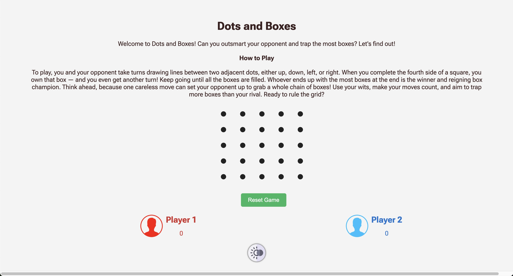
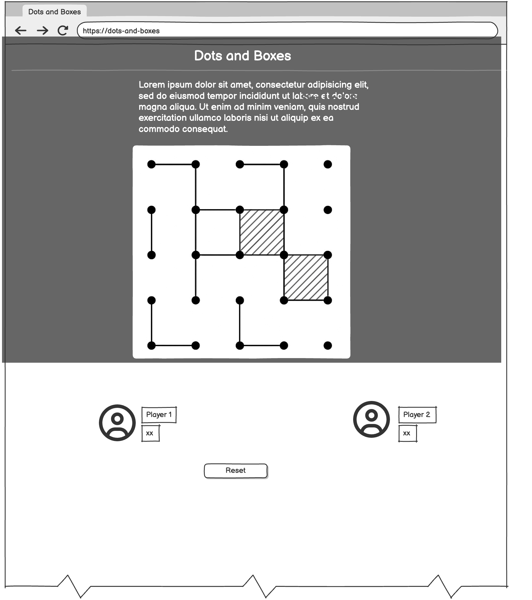
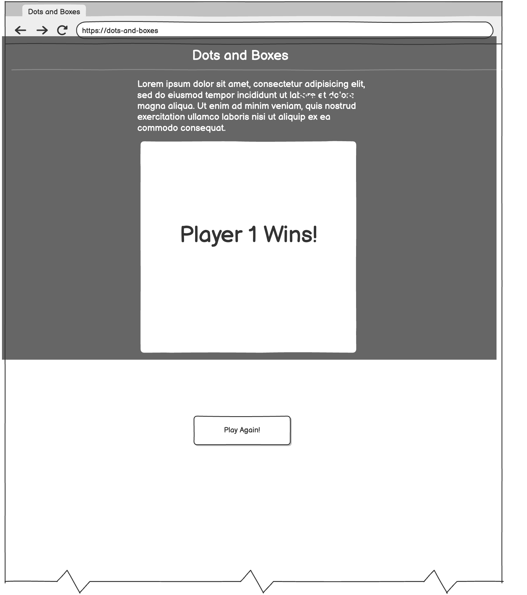

# Dots and boxes

## Description

**Dots and Boxes** is a two-player strategy game where players take turns clicking on adjacent dots to draw lines. Completing the fourth side of a box captures it, gives that player a point, and grants an extra turn. The goal is to finish with the most boxes. The game offers a 5x5 grid and includes a basic AI opponent (Player 2) that looks for scoring moves when possible. It also includes features like real-time scoring, a reset button, dark/light mode toggle, and a full-screen game-over message with a play-again option.

---

## Getting Started

**Play here:**  
[ Live Game Deployment](https://diana961216.github.io/Dots-and-Boxes/)

## Installation Instructions

- Visit the deployed site in your browser
- The game loads with a 5x5 grid by default
- Click two adjacent dots to begin playing!

---

**Planning materials:**

- [Trello Board](https://trello.com/b/5XCmM7b6/dots-and-boxes)
- [GitHub Repository](https://github.com/Diana961216/Dots-and-boxes-planning)

---

## Attributions

- [Moon Icon - Flaticon](https://www.flaticon.com/free-icons/dark-mode)
- Player avatar icons from [CityPNG](https://www.citypng.com/)
- Fonts provided by [Google Fonts](https://fonts.google.com/)

---

## Technologies Used

- **HTML5**
- **CSS3**
- **JavaScript**

---

## Approach Taken

I started by creating the HTML structure and dynamically generating a grid of 25 dots using JavaScript. I used the <canvas> element to draw lines between selected dots and implemented logic to validate whether the two dots were adjacent. I stored drawn lines in a Set to prevent duplicates.

Once line drawing worked, I focused on box detection using a set of pre-defined dot groupings. I displayed player initials inside completed boxes using canvas text, and awarded extra turns when a box was claimed. I built a basic AI opponent that checks if it can complete a box; if not, it picks a random valid move.

For user experience, I added a turn indicator using avatar highlights, a dark/light mode toggle button with icon support, and a styled game-over screen that displays the winner or a tie message. The reset button clears all canvas drawings, resets scores, and regenerates the board. All colors were tested for WCAG 2.0 AA accessibility, and UI components were styled with Flexbox and Grid.

---

## Wireframe

---

## Stretch Goals

- I wanted to add hover effects on valid line positions so players could visually see where they were allowed to draw a line, but I didn’t get a chance to implement it.
- I also planned to add an option to choose different grid sizes (like 3x3 or 4x4) in addition to the default 5x5, but this feature wasn't implemented in the final version.

---

## Project Links

**[Trello Board](https://trello.com/b/5XCmM7b6/dots-and-boxes)**

**[Git Hub](https://github.com/Diana961216/Dots-and-Boxes)**
**[ Live Game Deployment](https://diana961216.github.io/Dots-and-Boxes/)**
